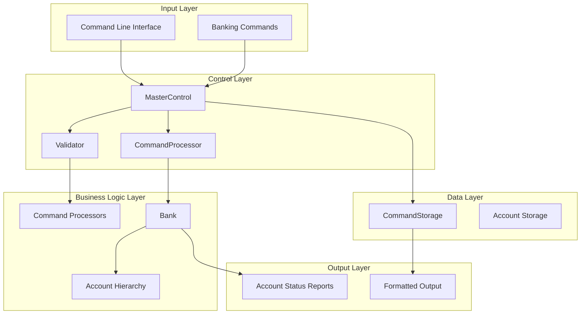
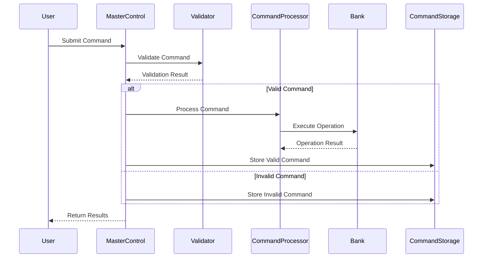
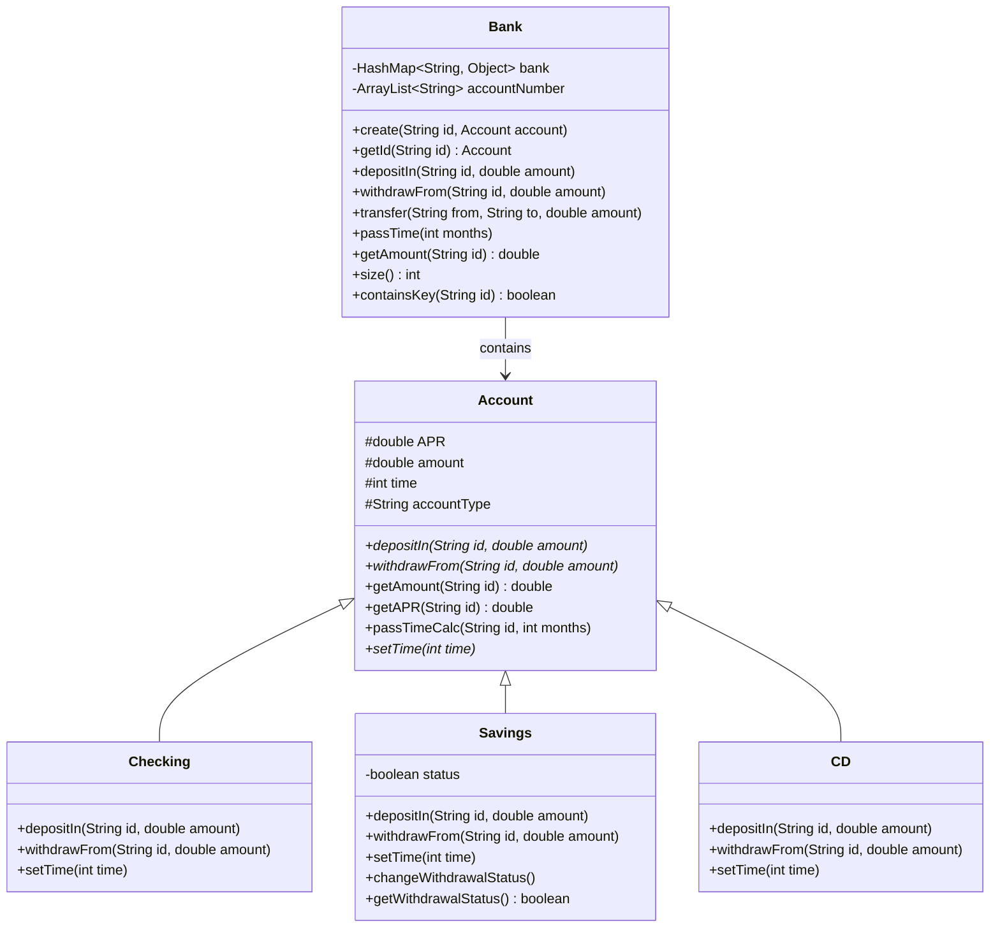
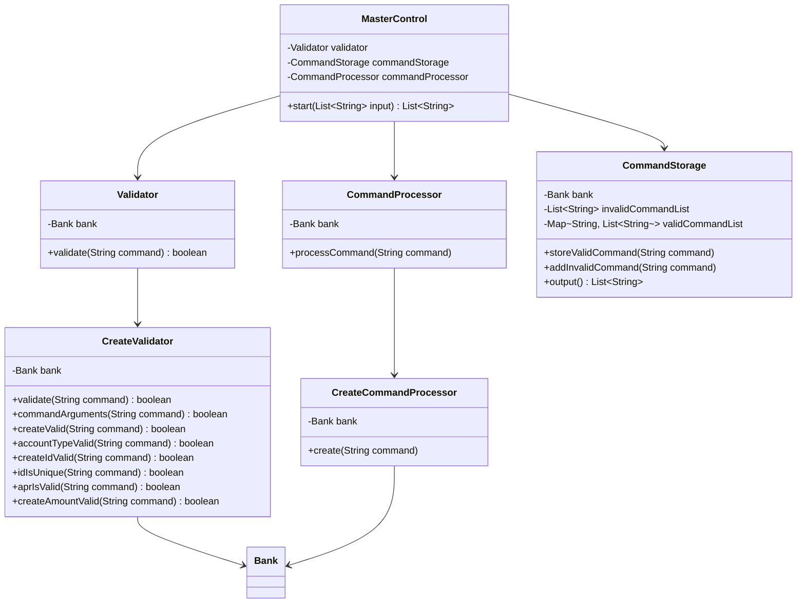
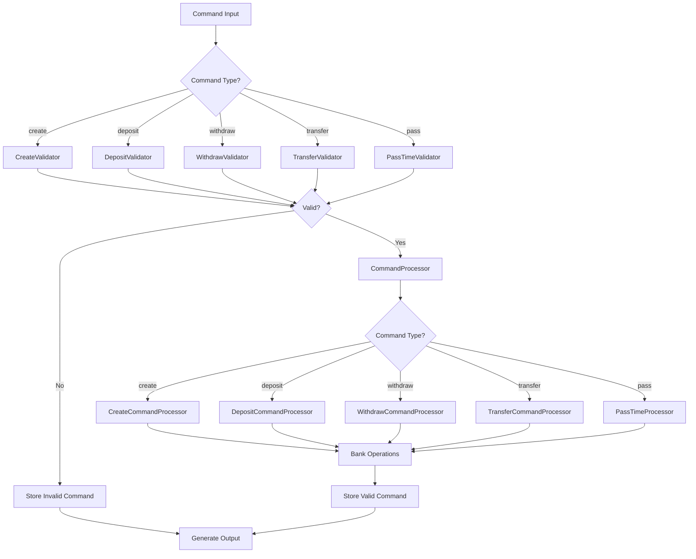
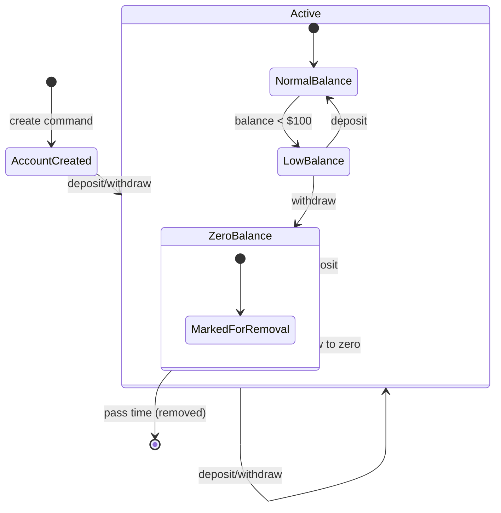
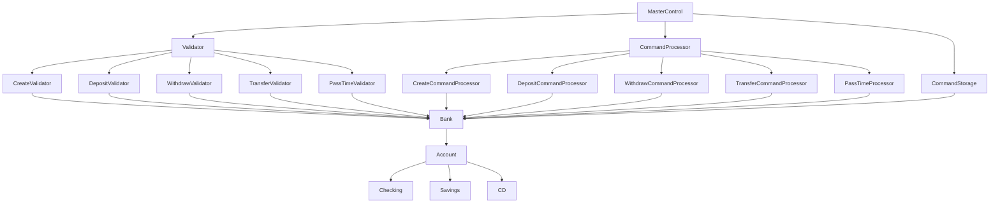

# Architecture & Design Documentation
## TDD Banking Application

### Document Information
- **Version**: 1.0
- **Date**: December 2024
- **Project**: TDD Banking Application

---

## 1. High-Level Architecture

### 1.1 System Overview
The TDD Banking Application follows a layered architecture pattern with clear separation of concerns. The system is designed as a command-processing application that handles banking operations through a structured pipeline.

### 1.2 Architectural Patterns
- **Command Pattern**: Used for processing different types of banking commands
- **Strategy Pattern**: Implemented for different account types and validation strategies
- **Template Method Pattern**: Used in the Account hierarchy for common operations
- **Factory Pattern**: Implicit in command processor creation

### 1.3 System Components



---

## 2. Detailed Component Architecture

### 2.1 Core Components

#### 2.1.1 MasterControl
- **Purpose**: Central orchestrator for command processing
- **Responsibilities**:
  - Coordinate validation, processing, and storage
  - Manage command flow through the system
  - Return processed results

#### 2.1.2 Bank
- **Purpose**: Core business entity managing accounts and transactions
- **Responsibilities**:
  - Account lifecycle management
  - Transaction processing
  - Interest calculations
  - Account storage and retrieval

#### 2.1.3 Account Hierarchy
- **Purpose**: Represent different types of banking accounts
- **Responsibilities**:
  - Encapsulate account-specific behavior
  - Handle deposits and withdrawals
  - Calculate interest based on account type

### 2.2 Command Processing Architecture



---

## 3. Class Diagrams

### 3.1 Core Class Structure



### 3.2 Command Processing Classes



---

## 4. Data Flow Architecture

### 4.1 Command Processing Flow



### 4.2 Account State Management



---

## 5. Security Architecture

### 5.1 Input Validation
- **Command Syntax Validation**: All commands must follow strict syntax rules
- **Parameter Validation**: Account IDs, amounts, and APRs are validated
- **Business Rule Validation**: Account-specific rules are enforced

### 5.2 Data Integrity
- **Atomic Operations**: Each command is processed as a single unit
- **Balance Validation**: Account balances cannot go negative
- **Unique Constraints**: Account IDs must be unique

### 5.3 Error Handling
- **Graceful Degradation**: Invalid commands are logged but don't stop processing
- **Comprehensive Logging**: All commands and errors are tracked
- **Validation Feedback**: Clear error messages for invalid inputs

---

## 6. Performance Considerations

### 6.1 Memory Management
- **HashMap Storage**: Efficient account lookup using HashMap
- **ArrayList Tracking**: Ordered account number tracking
- **Command Caching**: Valid commands are stored for output generation

### 6.2 Processing Efficiency
- **Single-Pass Processing**: Commands are processed sequentially
- **Lazy Evaluation**: Interest calculations are performed only when needed
- **Batch Operations**: Time progression processes all accounts at once

---

## 7. Design Patterns Implementation

### 7.1 Command Pattern
```java
// Command processing follows the Command pattern
public void processCommand(String command) {
    String[] parts = command.split(" ");
    String commandType = parts[0];
    
    switch(commandType.toLowerCase()) {
        case "create":
            // CreateCommandProcessor handles creation
            break;
        case "deposit":
            // DepositCommandProcessor handles deposits
            break;
        // ... other commands
    }
}
```

### 7.2 Strategy Pattern
```java
// Different validation strategies for different commands
public boolean validate(String command) {
    String[] parts = command.split(" ");
    String commandType = parts[0];
    
    switch(commandType.toLowerCase()) {
        case "create":
            return new CreateValidator(bank).validate(command);
        case "deposit":
            return new DepositValidator(bank).validate(command);
        // ... other validators
    }
}
```

### 7.3 Template Method Pattern
```java
// Account hierarchy uses template method for common operations
public abstract class Account {
    // Common implementation
    public void passTimeCalc(String id, int months) {
        time += months;
        if (accountType.equalsIgnoreCase("CD")) {
            // CD-specific interest calculation
        } else {
            // Standard interest calculation
        }
    }
}
```

---

## 8. Component Dependencies

### 8.1 Dependency Graph



### 8.2 Coupling Analysis
- **Low Coupling**: Components are loosely coupled through interfaces
- **High Cohesion**: Related functionality is grouped together
- **Dependency Injection**: Dependencies are injected through constructors

---

## 9. Scalability Considerations

### 9.1 Current Limitations
- Single-threaded processing
- In-memory storage only
- No persistence layer

### 9.2 Potential Improvements
- **Database Integration**: Replace HashMap with database storage
- **Concurrent Processing**: Add multi-threading support
- **Caching Layer**: Implement caching for frequently accessed accounts
- **Load Balancing**: Distribute processing across multiple instances

---

## 10. Technology Stack

### 10.1 Core Technologies
- **Java 8+**: Primary programming language
- **JUnit 5**: Testing framework
- **Gradle**: Build automation
- **JaCoCo**: Code coverage analysis

### 10.2 Design Principles
- **SOLID Principles**: Single responsibility, open/closed, Liskov substitution, interface segregation, dependency inversion
- **DRY Principle**: Don't repeat yourself
- **KISS Principle**: Keep it simple, stupid
- **YAGNI Principle**: You aren't gonna need it

---

*This architecture documentation is based on the actual implementation of the TDD Banking Application and reflects the current system design as of December 2024.*
